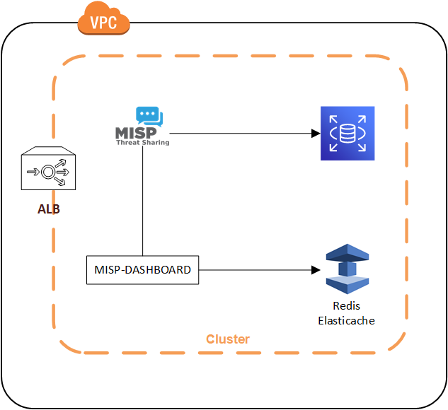

# MISP-K8S
> Automated deployment of MISP and MISP-DASHBOARD to K8S and AWS


Provide an automated deployment with High Availability for MISP and MISP-Dashboard in K8S and AWS.
The project use the following technologies :
- Terraform to automate the deployment,;
- AWS RDS to persist data for MISP;
- Elasticache Redis to persist data for MISP-Dashboard;
- Route53 to manage certificate and DNS entries;
- Kubernetes to host the MISP and MISP-Dashboard docker image

The following containers are used for the deployment :
- https://hub.docker.com/repository/docker/xyrodileas/misp/
- https://hub.docker.com/repository/docker/xyrodileas/misp-dashboard



## Deployment

Configure the variables in prod.tfvars
Then, from the CLI :
```sh
terraform init -backend-config="key=misp" -backend-config="bucket=$(STATE_STORAGE_BUCKET)" -backend-config="region=$(STATE_STORAGE_REGION)"
terraform plan -var-file=prod.tfvars -input=false -out=plan.tfplan
terraform apply --auto-approve -input=false plan.tfplan
```

## Release History

* 0.1
    * Initial release

## Contributor

* Alexis Vuillaume – [@Xyrodileas](https://twitter.com/Xyrodileas)
* Jerem991 - https://github.com/jerem991
* JYNolen - https://github.com/jynolen
* VVX7 - https://github.com/VVX7
* apleks_ - [@apleks_](https://twitter.com/apleks_)

Special Thanks to the following projects :
- https://github.com/MISP/misp-docker (The container used is heavily forked from the official MISP repository)
- https://github.com/MISP/misp-dashboard

Distributed under the GPL3. See ``LICENSE`` for more information.

## Contributing

1. Fork it (<https://github.com/yourname/yourproject/fork>)
2. Create your feature branch (`git checkout -b feature/fooBar`)
3. Commit your changes (`git commit -am 'Add some fooBar'`)
4. Push to the branch (`git push origin feature/fooBar`)
5. Create a new Pull Request
