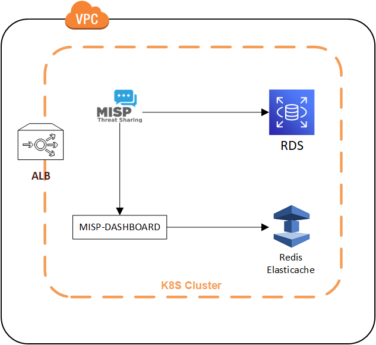
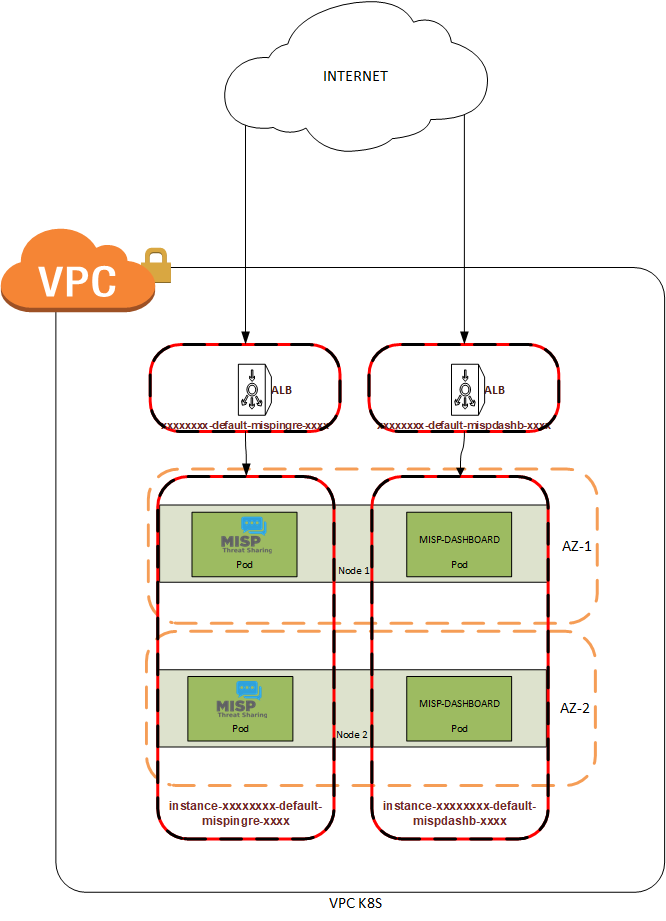

# MISP-K8S
> Automated deployment of MISP and MISP-DASHBOARD to K8S and AWS


Provide an automated deployment with High Availability for MISP and MISP-Dashboard in K8S and AWS.
The project uses the following technologies :
- Terraform to automate the deployment;
- AWS RDS to persist data for MISP;
- Elasticache Redis to persist data for MISP-Dashboard;
- Route53 to manage certificate and DNS entries;
- Kubernetes to host the MISP and MISP-Dashboard docker image

The following containers are used for the deployment :
- https://hub.docker.com/repository/docker/xyrodileas/misp/
- https://hub.docker.com/repository/docker/xyrodileas/misp-dashboard



## Deployment

Configure the variables in prod.tfvars
Configure the Kube config provbider.tf :
```sh
config_path = "/tmp/kubeconfig"
```

Then, from the CLI :
```sh
terraform init -backend-config="key=misp" -backend-config="bucket=$(STATE_STORAGE_BUCKET)" -backend-config="region=$(STATE_STORAGE_REGION)"
terraform plan -var-file=prod.tfvars -input=false -out=plan.tfplan
terraform apply --auto-approve -input=false plan.tfplan
```

## Security groups

| SG Name | Protocol | Port | Source | Description |
|---------|----------|------|--------|-------------|
xxxxxxxx-default-mispingre-xxxx | HTTPS | 443 | IP in authorized_ips | Managed LoadBalancer securityGroup by ALB Ingress Controller to authorize https traffic from external to the ALB in front of the misp container |
xxxxxxxx-default-mispdashb-xxxx | HTTPS | 443 | IP in authorized_ips | Managed LoadBalancer securityGroup by ALB Ingress Controller to authorize authorize https traffic from external to the ALB in front of the misp-dashboard container |
instance-xxxxxxxx-default-mispdashb-xxxx | ALL | 0-65535 | IP in authorized_ips | SG to authorize authorize traffic from the ALB to misp-dashboard container |
instance-xxxxxxxx-default-mispingre-xxxx | ALL | 0-65535 | IP in authorized_ips | SG to authorize authorize traffic from the ALB to misp-dashboard container |

Note that the following Security groups are imported from the EKS deployment :
- eks-[env]-node-ext-sg : Used to allow communication between nodes, and between nodes and the Cluster Control Plane.

## Kubernetes

To deploy MISP, we used our internal Kubernetes Cluster, based on EKS.
This allow us to abstract the infrastructure layers for developers in order to scale and orchestrate our workload.

This deployment could be ported to an on-prem cluster, but change related to RDS and Redis will be required.
By default, RDS and Redis are not publicly available outside of AWS.



## AWS RDS and Elasticache Redis

In order to have high availability for storages (RDS and Redis), we choose to use the managed services AWS RDS and Elasticache Redis in order to reduce the complexity and the maintenance required by deployment :
- RDS and Elasticache are multi AZ;
- Backup and restore are managed by AWS;
- Easier to scale up.

Be mindful that the default configuration allow terraform to destroy RDS and Redis. Make sure you have regular backup.

## Release History

* 0.1
    * Initial release

## Contributor

* Alexis Vuillaume – [@Xyrodileas](https://twitter.com/Xyrodileas)
* Jerem991 - https://github.com/jerem991
* JYNolen - https://github.com/jynolen
* Roger Johnston - [@VV_X_7](https://twitter.com/VV_X_7) https://github.com/VVX7
* Alexis Tremblay - [@apleks_](https://twitter.com/apleks_)

Special Thanks to the following projects :
- https://github.com/MISP/misp-docker (The container used is heavily forked from the official MISP repository)
- https://github.com/MISP/misp-dashboard
- https://github.com/0xtf/HAMISPA (Thank you @0xtf for inspiring this project!)

Distributed under the GPL3. See ``LICENSE`` for more information.

## Contributing

1. Fork it (<https://github.com/yourname/yourproject/fork>)
2. Create your feature branch (`git checkout -b feature/fooBar`)
3. Commit your changes (`git commit -am 'Add some fooBar'`)
4. Push to the branch (`git push origin feature/fooBar`)
5. Create a new Pull Request
